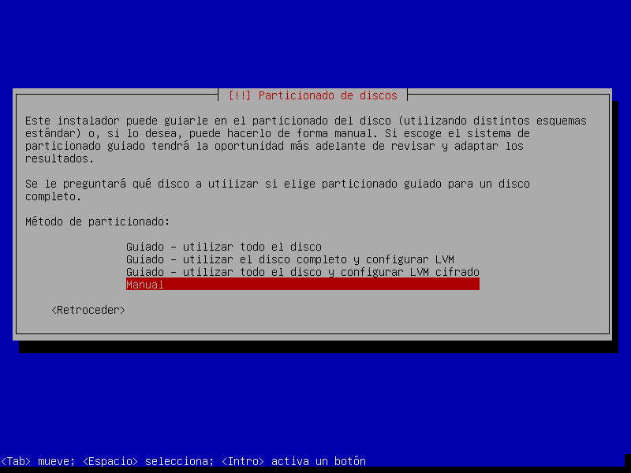
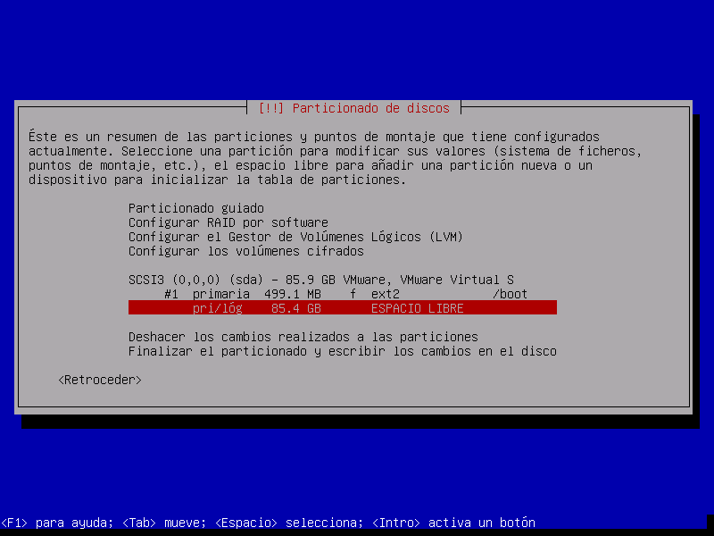

# Instalacion Debian 7 Wheezy para un entorno de virtualizacion
## Consideraciones previas
* Se debe asegurar que el equipo soporte virtualizacion por hardware que generalmen se encuantra en las opciones del procesador en el BIOS del computador. En maquinas linux se puede observar lo anterior mediante el comando:
`grep vmx /proc/cpuinfo` que tras su ejecucion mostrará algo parecido:
```
sampc@host-01:~$ sudo grep --color vmx /proc/cpuinfo 
flags		: fpu vme de pse tsc msr pae mce cx8 apic sep mtrr pge mca cmov pat pse36 clflush dts mmx fxsr sse sse2 ss ht syscall nx rdtscp lm constant_tsc arch_perfmon pebs bts nopl xtopology tsc_reliable nonstop_tsc aperfmperf pni pclmulqdq vmx ssse3 cx16 sse4_1 sse4_2 x2apic popcnt aes hypervisor lahf_lm ida arat dtherm tpr_shadow vnmi ept vpid
flags		: fpu vme de pse tsc msr pae mce cx8 apic sep mtrr pge mca cmov pat pse36 clflush dts mmx fxsr sse sse2 ss ht syscall nx rdtscp lm constant_tsc arch_perfmon pebs bts nopl xtopology tsc_reliable nonstop_tsc aperfmperf pni pclmulqdq vmx ssse3 cx16 sse4_1 sse4_2 x2apic popcnt aes hypervisor lahf_lm ida arat dtherm tpr_shadow vnmi ept vpid
flags		: fpu vme de pse tsc msr pae mce cx8 apic sep mtrr pge mca cmov pat pse36 clflush dts mmx fxsr sse sse2 ss ht syscall nx rdtscp lm constant_tsc arch_perfmon pebs bts nopl xtopology tsc_reliable nonstop_tsc aperfmperf pni pclmulqdq vmx ssse3 cx16 sse4_1 sse4_2 x2apic popcnt aes hypervisor lahf_lm ida arat dtherm tpr_shadow vnmi ept vpid
flags		: fpu vme de pse tsc msr pae mce cx8 apic sep mtrr pge mca cmov pat pse36 clflush dts mmx fxsr sse sse2 ss ht syscall nx rdtscp lm constant_tsc arch_perfmon pebs bts nopl xtopology tsc_reliable nonstop_tsc aperfmperf pni pclmulqdq vmx ssse3 cx16 sse4_1 sse4_2 x2apic popcnt aes hypervisor lahf_lm ida arat dtherm tpr_shadow vnmi ept vpid
```

## Proceso de instalación

1. Iniciar el equipo para que inicie desde el DVD/CD. Una vez que haya arrancado, se verá la siguiente pantalla en donde se deberá seleccionar la primera opcion:


2. Escogemos el idioma


3. Escogemos la Ubicacion


4. Escogemos la distribucion del teclado que usaremos para la administracion directa


5. Definimos un nombre para el servidor


6. Definimos un dominio para el equipo


7. Definimos la clave de root y la confirmamos


8. Definimos una cuenta de usuario con los siguientes datos: Nombre completo, cuenta y contraseña


9. El instalador tratará de sincronizar la hora de la red


10. A continuacion se deberá particionar el Disco duro:


11. Seleccionamos el tipo de particionado, en este caso: Manual


12. Seleccionamos el tipo de particion, es este caso será particion primaria


13. Definmos el tamaño de la partición, para el ejemplo se creará la particion /boot:


14. Se elige el tipo de particion:


15. Se elige la ubicacion de la particion dentro del espacio disponble:


16. Se configura la partición. En este caso se eligió, para la partición /boot, el sistema de archivos ext2 ya que se trata de una partición pequeña y para que el arranque de la maquina sea rapida.


17. Tras terminar de definir la particion, se muestra un resumen de los cambio efectuados hasta el momento:


18. Finalmente, tras definir el resto de particiones, se muetra el resumen completo de los cambios realizados:


19. Se confirman los cambios a realizar:


20. Se inicia el proceso de instalacion del sistema base:


21. Se sugiere instalar una replica de red para completar los paquetes de instalacion, se elige NO


22. A la pregunta sobre la encuesta de popularidad de los paquetes usados se responde NO:


23. Seguidamente seleccionamos los grupos de programas a instalar. En este caso al tratarse de un servidor donde se instalaran maquinas virtuales y a partir del cual se administrarán los mismos, elegimos: El ambiente de escritorio de Debian, el servidor SSH, porgramas de Laptop y utilidades estandar del sistema:


24. Tras la instalacion, se nos pregunta si se instalará el cargador de arranque GRUB, a la pregunta respondemos SI:


25. Finalmente, se nos puestra una pantalla donde se nos indica que el proceso de instalacion terminó y que se debe extraer cualquier medio de instalaciobn para inciar el equipo:

