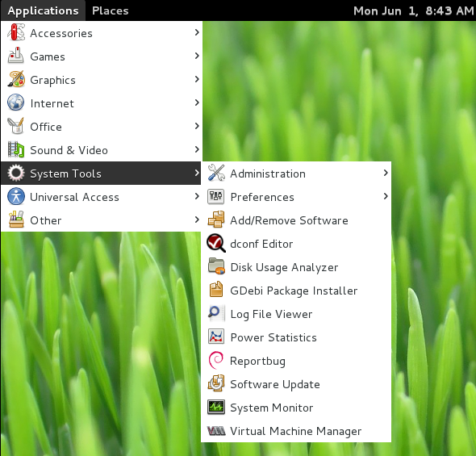
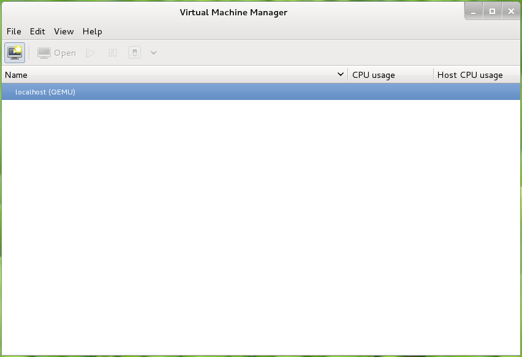

# Instalacion del Entorno de Virtualización
## Pasos previos
Se debe instalar el programa **sudo** que es  una utilidad que proporciona limitados privilegios a usuarios del sistema para proceder con la instalación de la plataforma de virtualizacion y otras tareas que requieren privilegios especiales a fin de no usar directamente el usuario 
```
~$ su
~$ apt-get install sudo
```
A continuacion adicionamos al usuario al **grupo sudo**
```
~$ su
~$ adduser sampc sudo
```
Despues de agregar al usuario, debemos cerrar la sesion actual para que se apliquen los cambios.

## Instalacion de la platafomra de virtualización KVM y su administrador
Para la plataforma KVM desde linea de comandos digitar:
```
~$ sudo apt-get -y install qemu-kvm libvirt-bin virtinst virt-viewer
```
Para instalar el adminstrador de maquinas virtuales ajo entorno gráfico
```
~$ apt-get install virt-manager
```
A continuacion, se debe adicionar al usuario sin privilegios a los grupos **kvm** y **libvirt** para administrar la plataforma de virtualizacion:
```
~$ adduser sampc kvm
~$ adduser sampc libvirt
```
Despues de esto cerramos secion para que los cambios realizados se apliquen sobre el usurio sin privilegios.

## PLataforma de Virtualizacion
Una vez se haya iniciado sesion con el usuario sin pŕivilegios, se podrá acceder a través del acceso directo `Applications>System Tools>Virtual Machine Manager`


La pantalla de administracion de maquinas virtualizacion deberá tener el siguiente aspecto:

