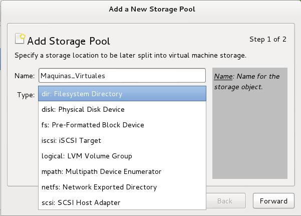
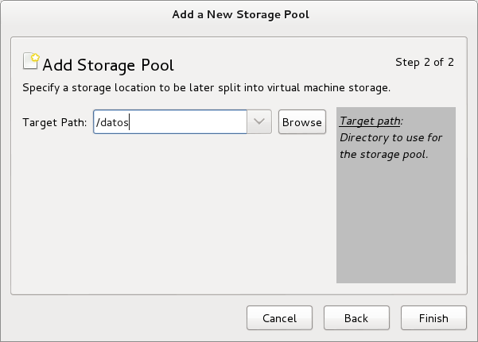

# Tareas a realizar mediante el administrador de maquinas virtuales (Virtual Machine Manager)
Para realizar las tareas de administracion de las redes virtuales y el almacenamiento se debe acceder a las propiedades (Detalles del servidor **localhost**)


Tras la selección de la opcion **Detalles** se mostrará la siguiente ventana:


##1. Creacion de redes virtuales
Ya sea para crear redes virtuales, alamacenamiento o interfaces de red se cuentan con los siguientes botones de operacion:
- Añadir  
- Iniciar  
- Detener  
- Eliminar  

Para crear una nueva red virtual, hacemos click en el boton de Añadir Red Virtual  que iniciara una asistente para su configuracion:


Deberemos completar cuatro pasos para su correcta configuracion:
1. Nombre de la red virtual:

2. Segmento de red IPv4

3. Rango DHCP. Es posible definir un rango de direcciones para que puedan ser provistas a traves del servicio DHCP. La configuracion viene con un rango de direccion prefedini a que se puede cambiar. El servicio funciona siempre y cuando se tenga habilitada la opcion **Habilitar DHCP**

4. Configuración del la conectividad a la red física. Es posible crear una red ahislada o con concetividad a la red fisica del host, para tal caso se debe activar el reenvio a la red fisica (cualquiera que éste activa en ese momento y a través de NAT)

5. Resumen. Finalmente, se presenta un resumen de las configuraciones a aplicar:


Una vez creada la red virtual nos aparecera una pantalla donde nos muestra el listado de redes.

Se puede observar que no esta activa. Para activarla se debe hacer un click en el boton  y seleccionar la opción **Autostart** y despues click en el boton **Apply** para que al momento del arranque este disponible.
##2. Creacion de almacenamiento
### Consideraciones previas
Para el almacenamiento se ha creado el directorio `/datos` en el cual se almacenaran los archivos de las maquinas creadas:
```
~$ sudo mkdir /datos
```
### Proceso de configuracion del almacenamiento
Existen dos partes que se deben completar para tener el almacenamiento listo para las maquinas virtuales a crear:
- Creación del Pool de Almacenamiento.
- Creación del Volumen sobre Algun Pool disponible.


**Creación del Pool de Almacenamiento.** Para crear el Pool de Almacenamiento hacemos click sobre el botón , seguidamente se iniciará el asistente de creacion del Pool de Almacenamiento:

Finalmente, se deberá indicar la ubicacion fisica (directorio) donde se guardaran los volumenes a crear, en este caso `/datos`:


**Creación del volumen.** Para la creación de un volumen sobre el pool seleccionado, hacemos click sobre el boton , seguidamente se mostrará la ventana de creación del nuevo volumen:

donde se le asignara un nombre al nuevo volumen de tipo `qcow2` y una capacidad determinada, en este caso `3000 MB`.