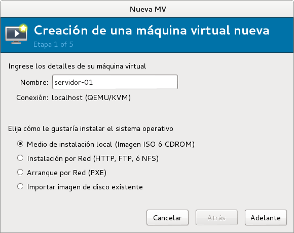

# Instalacion de una maquina virtual
## Pasos de la instalación
Para instalar una maquina virtual sobre la plataforma de virtualizacion se siguen los siguientes pasos:
1. Hacer click sobre el boton de creacion de maquina virtual 
2. En la primera ventana del asistente indicamos el nombre de la maquina virtual y elegimos el medio de instalación:

3. Seguidamente seleccionamos la fuente de instalacion y el tipo de Sistema Operativo a instalar, en este caso Linux Debian Wheezy:

4. Definimos la cantidad de memoria a asignar y la cantidad de procesadores (CPU's):

5. Indicamos el medio de almacenamiento. En este caso elegimos el volumen creado en las tareas administrativas de la plataforma de administracion:

6. Finalmente, se mostrará un resumen junto con la red virtual a usar. En este punto se puede elegir la red virtual creada en las tareas administrativas de la plataforma de administracion:

## Vista detalles de la maquina virtual
Una vez creada la maquina virtual, en cualquier momento y de acuerdo a necesidades es posible meodificar la configuracion del hardware virtual definido al momento de su creacion a través del boton . Al ejecutar este boton se mostrará la pantalla de edición de caracteristicas de hardware de la maquina virtual:

## Proceso de Instalación
Una vez creada la maquina virtual se debe iniciar el mismo con el botón . El proceso de Instalacion es el mismo que el de host variando unicamente en la parte fianl de seleecion de programas donde solo se deben seleccionar unicamente **SSH server** y **Utilidades éstandar del sistema**.