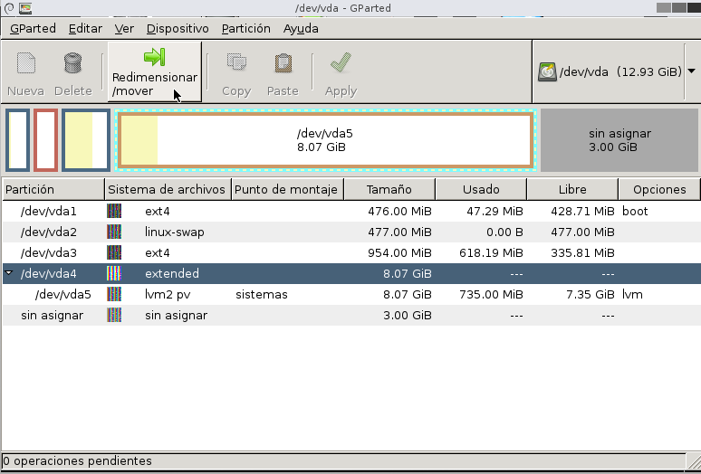

# Administracion de Discos: ampliacion y reduccion
## Ampliacion del tamaño asignado:
1. En una consola del **host** ejecutar el siguiente comando para incrementar el volumen asignado a la maquina virtual en 7GB:
```
~$ sudo quemu-img resize /datos/lvm1.img +7G
```
2. Apagar la maquina virtual y arrancar desde el CD ROM con el gparted.iso

3. Expandir la particion extendida desde el modo grafico.
Seleccionamos la opcion `Don't touch keymap`:

Seleccionamos el el idioma español:

Seleccionamos el modo grafico:

Finalmente vemos la utilidad en modo grafico:

4. Expandir la particion LVM desde el mod gráfico
Seleccionamos la particion extendida y la ampliamos:

Seleccionamos la particion LVM y la ampliamos:

5. Aplicar los cambios y reiniciar la maquina virtual

6. En modo consola ejecutamos los siguientes comandos para ampliar el volumen logico:
```
~$ sudo lvs
~$ sudo lvextend -L +1000 /dev/mapper/sistemas-tmp
~$ sudo umount /tmp
~$ sudo e2fsck -f /dev/mapper/sistemas-tmp
~$ sudo resize2fs /dev/mapper/sistemas-tmp
~$ sudo mount /tmp/
~$ sudo df -h
```